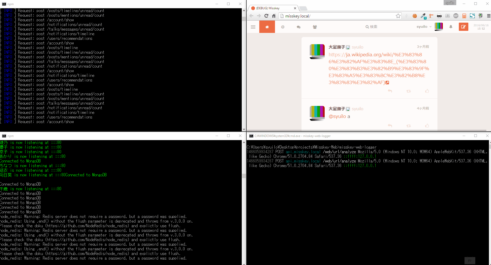

misskey-web-logger
------------------

[![][npm-badge]][npm-link]
[![][travis-badge]][travis-link]
[![][david-badge]][david-link]
[![][david-dev-badge]][david-dev-link]
[![][mit-badge]][mit]

Logger for [Misskey-Web](https://github.com/MissKernel/Misskey-Web)



## Install
``` shell
$ npm i misskey-web-logger -g
```

## Run
``` shell
$ misskey-web-logger
```

## Use
### Output to a file
``` shell
$ misskey-web-logger > file.txt
```

## Help
``` shell
$ misskey-web-logger -h
```

## License
[MIT](LICENSE)

[npm-link]:        https://www.npmjs.com/package/misskey-web-logger
[npm-badge]:       https://img.shields.io/npm/v/misskey-web-logger.svg?style=flat-square
[mit]:             http://opensource.org/licenses/MIT
[mit-badge]:       https://img.shields.io/badge/license-MIT-444444.svg?style=flat-square
[travis-link]:     https://travis-ci.org/syuilo/misskey-web-logger
[travis-badge]:    http://img.shields.io/travis/syuilo/misskey-web-logger.svg?style=flat-square
[david-link]:      https://david-dm.org/syuilo/misskey-web-logger#info=dependencies&view=table
[david-badge]:     https://img.shields.io/david/syuilo/misskey-web-logger.svg?style=flat-square
[david-dev-link]:  https://david-dm.org/syuilo/misskey-web-logger#info=devDependencies&view=table
[david-dev-badge]: https://img.shields.io/david/dev/syuilo/misskey-web-logger.svg?style=flat-square
